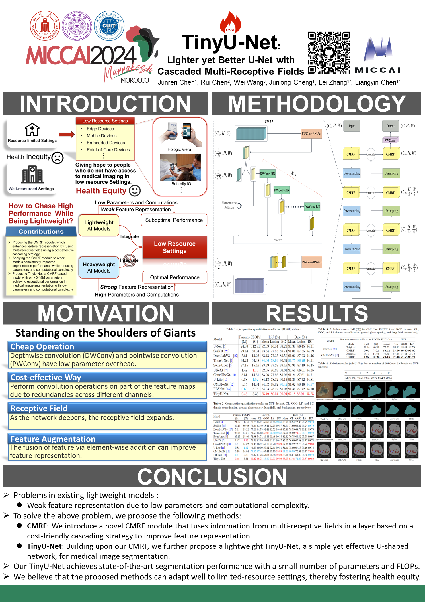

# TinyU-Net

[](https://opensource.org/licenses/MIT) 

Official implementation of the `MICCAI 2024` paper "[TinyU-Net: Lighter Yet Better U-Net with Cascaded Multi-receptive Fields](https://doi.org/10.1007/978-3-031-72114-4_60)".

🔥 This paper has been invited for an `ORAL` presentation (2.7%) in addition to a POSTER presentation. 

## BibTex
```bibtex
@InProceedings{Chen_TinyUNet_MICCAI2024,
        author    = {Chen, Junren and Chen, Rui and Wang, Wei and Cheng, Junlong and Zhang, Lei and Chen, Liangyin},
        title     = {TinyU-Net: Lighter Yet Better U-Net with Cascaded Multi-receptive Fields},
        booktitle = {proceedings of Medical Image Computing and Computer Assisted Intervention -- MICCAI 2024},
        year      = {2024},
        publisher = {Springer Nature Switzerland},
        volume    = {LNCS 15009},
        month     = {October},
        pages     = {626--635}
}
```

## Poster


## Data
- [ISIC2018](https://challenge.isic-archive.com/data/#2018). The ISIC2018 dataset consists of images with skin disease lesions (2594 training images, 100 validation images, and 1000 test images).
- [NCP](http://ncov-ai.big.ac.cn/download?lang=en). Lesion segmentation dataset of the CT slice images from the China Consortium of Chest CT Image Investigation (CC-CCII). A total of 750 CT slices from 150 COVID-19 patients were manually segmented into background, lung field, ground-glass opacity (GGO), and consolidation (CL).

## Results
 and NCP (bottom two rows) datasets.")
